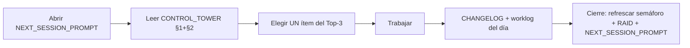

# Control Tower — capa de gobernanza de `mizolutions.com`

Artefactos vivos que dan visualización end-to-end del sitio landing y permiten
trackear actividades con orden, al estilo del repo principal de trading pero
**escalado** a lo que un sitio de marketing necesita (sin el aparato SRE de un
sistema LIVE).

> **Propósito:** responder en 30 segundos *"¿cómo está el sitio hoy y qué exige
> mi atención?"*. **Owner:** tú (single operator). **Cadencia:** actualizar al
> inicio y al cierre de cada sesión que toque el sitio.

## Archivos

| Archivo | Para qué | Cuándo lo lees | Cuándo lo actualizas |
|---|---|---|---|
| [CONTROL_TOWER.md](CONTROL_TOWER.md) | Semáforo G/Y/R por dominio + Top-3 del día | Inicio de sesión | Cierre de sesión |
| [RAID.md](RAID.md) | Risks · Assumptions · Issues · Decisions | Al decidir algo grande o ante un riesgo nuevo | Si hay cambios |
| [ROADMAP.md](ROADMAP.md) | Now / Next / Later legible | Inicio de sesión | Al re-priorizar |
| [NEXT_SESSION_PROMPT.md](NEXT_SESSION_PROMPT.md) | Prompt de arranque autocontenido | Al abrir la próxima sesión | Al cierre de cada sesión |
| [../adr/index.md](../adr/index.md) | Architecture Decision Records | Al revisitar una decisión | Al tomar una decisión nueva |
| [../worklog/](../worklog/) | Bitácora por sesión (qué se hizo) | Para reconstruir historia | Al cierre de cada sesión |
| [../../CHANGELOG.md](../../CHANGELOG.md) | Cambios notables del sitio | Antes de un release | Con cada cambio relevante |

## Flujo recomendado

## Relación con el repo de trading

Este sitio (`mizolutions/site`) es **independiente** del `mizolutions/trading-system`:
distinto lifecycle, distinto failure domain, distinto hosting (Vercel vs AWS ECS).
Trinitrade aparece aquí solo como **caso de estudio de confiabilidad** — sin claims
de P&L. No acoplar la infra de uno con la del otro (ver [ADR-004](../adr/004-dns-route53-zone-vercel-a-record.md)).

## Por qué esta capa existe

Desde el día 1 conviene la misma disciplina que el repo de trading: una fuente de
verdad de estado, un log de decisiones (ADR/RAID) y un prompt de arranque. Barato
de mantener cuando es pequeño; impagable cuando el sitio crezca (blog, SaaS,
subdominios).
